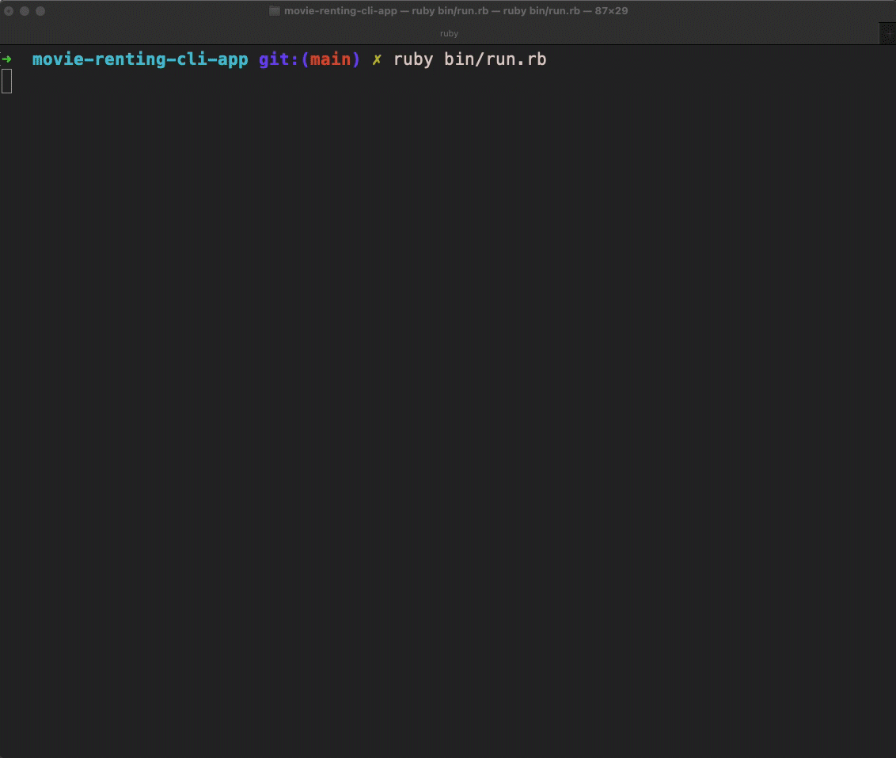

# Movies Renting CLI Program CRUD Application

A small movies renting program made with Ruby and SQLite

## TOOL

1. Ruby
2. Active Record
3. SQLite
4. CLI
  

## INTRUCTIONS

1. Clone this repository
2. Using the terminal navigate to the root directory
3. Run "Bundle Install"
4. Run "ruby bin/run.rb

## PREVIEW

* User can sign up or login (with right email address) to the application.
* User can edit their name, email address and also delete account.
* User can see all the movies in the application. User also can search movies by rating, by rate-age, or by name
* User can rent and return movies.
* User can keep track their history renting and the movies they haven't return yet.
* User can leave reviews and ratings for movies and it will update to database. 

### Built by Chi Nguyen and Rahel Hagos
